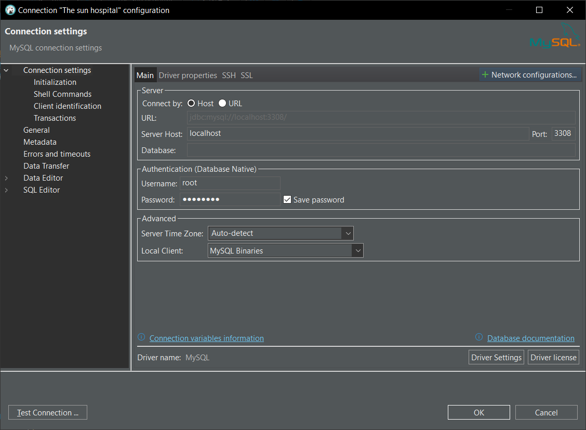
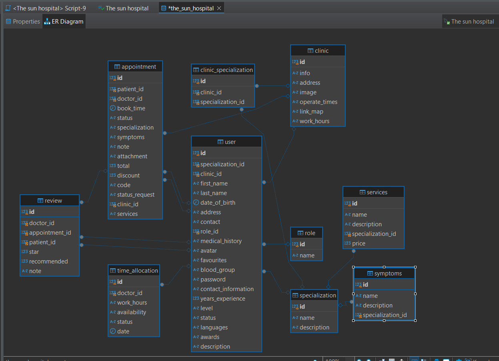

## Step to setup
Create a container in Docker

```cmd
docker run --name the-sun-hospital -p 3308:3306 -e MYSQL_ROOT_PASSWORD=admin123 -d mysql
```

Connect to DBeaver
```
Server Host: localhost
Port: 3308
Database: (empty, do not fill anything here)
Username: root
Password: admin123
Driver Properties: 
    allowPublicKeyRetrieval: true
```


You can set name to The sun hospital

Then go to file `initial.sql` and run all sql in that host
Check for the diagram in Bbeaver, it should look like this



